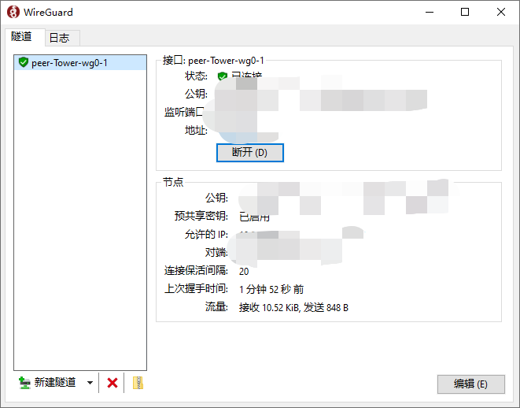

# WireGuard 自动重启

因为域名指向的 IP 会变动，经常会出现服务器 IP 变动，客户端不会自动判断域名对应的 IP 变化了，重连服务器，总是得手动重连一下。这个程序实现的就是自动重连。目前只支持 Windows，测试了 Windows 10 下，正常安装 WireGuard 情况下的使用。

> 注意，这个是给客户端用的，不是服务器



如图，你要看一下你的隧道的名称是啥，比如这里的："peer-Tower-wg0-1"

那么配置文件（config.yaml）：

```
domain: xx.xx.xx
tunnel_name: "peer-Tower-wg0-1"
interval: 5
ip_version: ipv4
```

* domain：这个就是你 WireGuard 服务器的域名，用于检测 IP 是否变化
* tunnel_name：如上图
* interval：检测间隔是 5 min
* ip_version：检测 IP 的版本，我是 IPV4，IPV6 没测试过，你也可以填写 "both"

> 可选：ipv4 or ipv6 or both

程序启动就会进行一次 IP 检测，一定会重启一次 WireGuard 的隧道链接。然后就等待你设置的间隔。

你可以使用 [winsw/winsw: A wrapper executable that can run any executable as a Windows service, in a permissive license.](https://github.com/winsw/winsw)

这个工具来注册为服务，或者设置为 Windows 定时任务（设置系统启动就执行这个程序，这些就请自行搜索教程把）

当然，本程序也集成了注册服务启动的功能，当然···这写有些年了，我不确定兼容性如何，不如使用上述的方案来使用，一定可行。doge